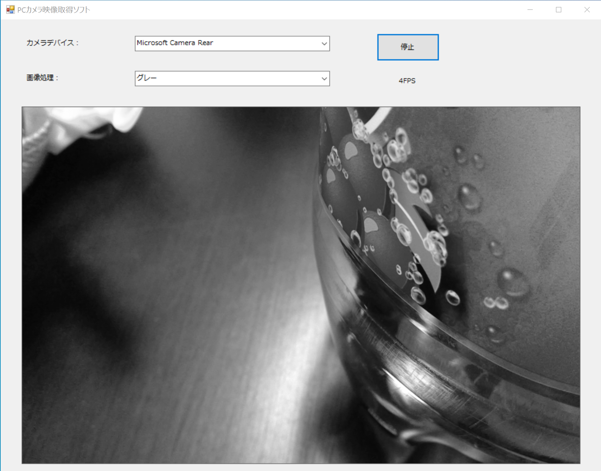
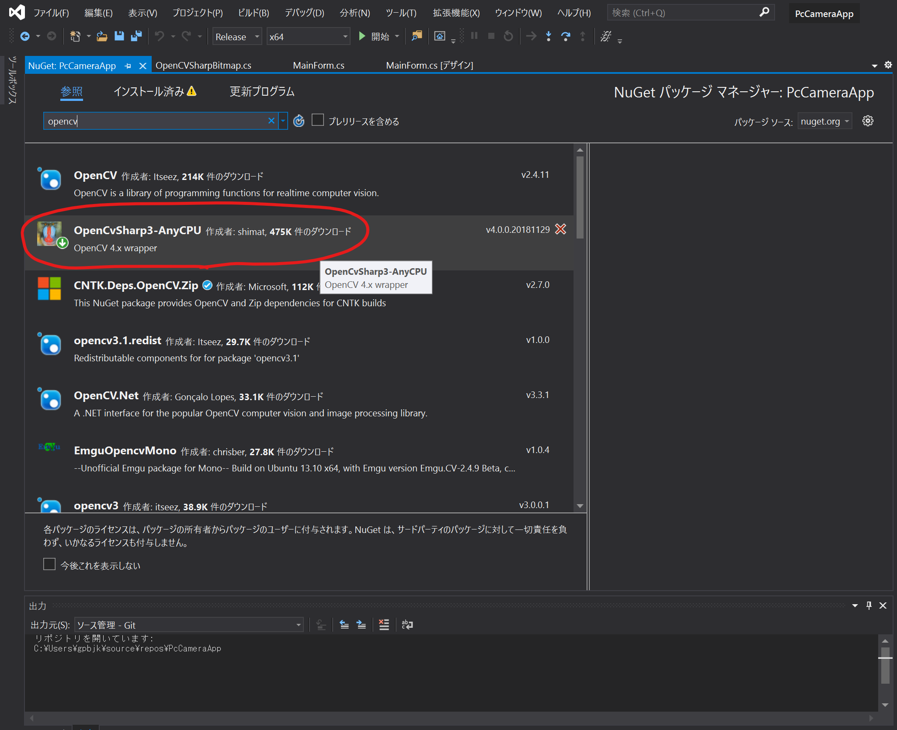
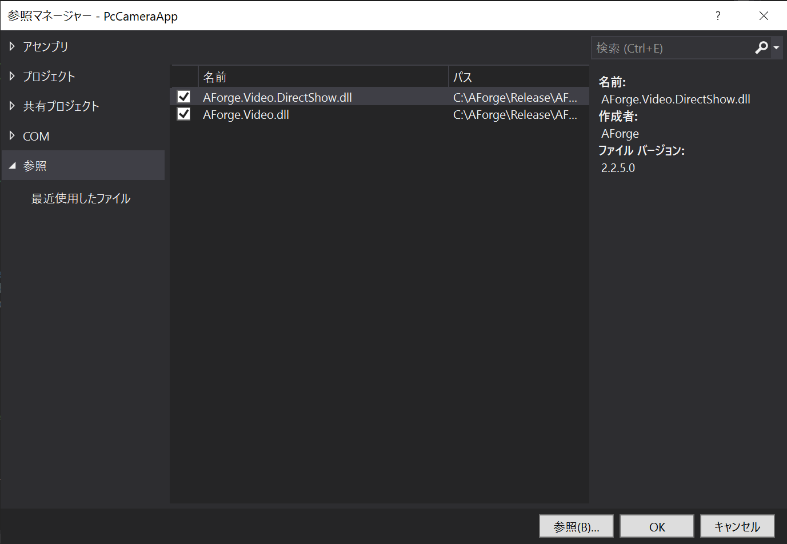
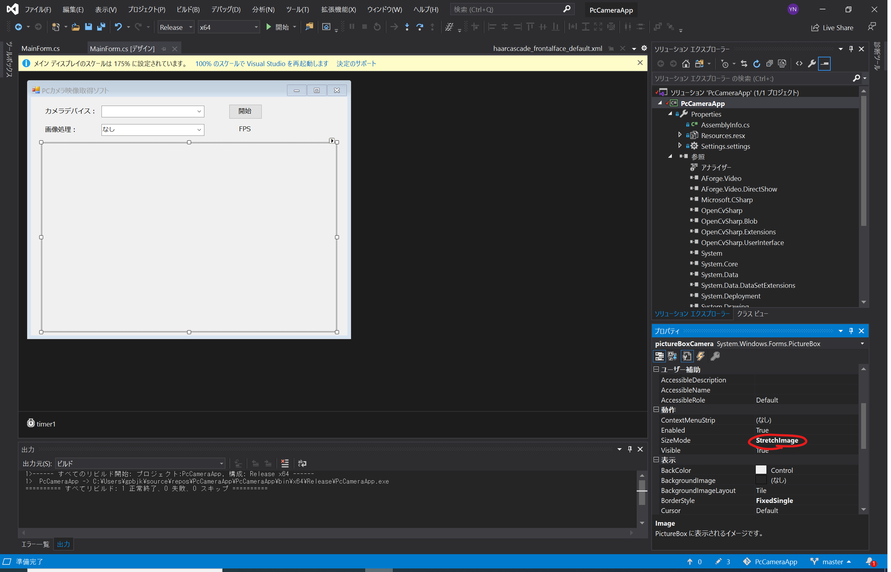
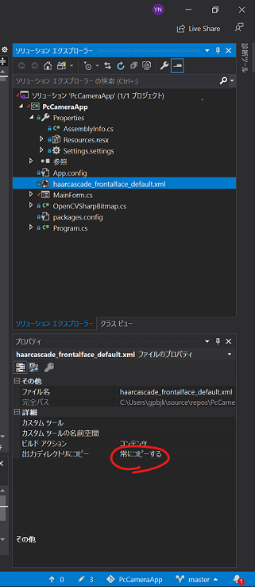

PCに搭載されているカメラの映像を取得して、解析等を行いたいと思ったことはないでしょうか？

今回、PCカメラの映像を加工して表示させるアプリケーションを作成しましたので紹介します。

[【ソースコードはこちら】](https://github.com/atman-33/pc-camera-app-cs)

**2020/4/14追記**  
ソースコードをダウンロードして、Visual Studio からソリューションファイルを開くと参照部分にエラーが発生する場合があります。Nugetパッケージをインストールして下さい。

___
## 概要
PCに内蔵されているカメラと画像処理モードを選択することで、対応した映像をアプリケーションに表示します。

【画像処理モード】
- なし
- グレー　：　映像がグレーになります。
- 顔認識　：　顔を認識した部分に赤の矩形を表示します。



___
## パッケージ構成
今回のアプリケーションはVisual Studioで作成しています。プロジェクトフォルダ内には多くのファイルが含まれておりますので、主なファイルのみ説明します。

こちらは、上でダウンロード可能なソースコードと対応しています。

```text
PcCameraApp
|-MainForm.cs
|-OpenCVSharpBitmap.cs
|-haarcascade_frontalface_default.xml
```

|ファイル名|機能|
|:--|:--|
MainForm.cs|アプリの操作に対する各種処理
OpenCVSharpBitmap.cs|映像を加工してBitmapで返すクラス
haarcascade_frontalface_default.xml|顔を検出するカスケードファイル

___
## 製作手順
Visual Studio を用いたアプリケーションの製作手順について説明していきます。

___
### ①プロジェクトの作成
プロジェクトの作成に関して、詳細の説明は省略させて頂きます。

下記リンクを参考にしてプロジェクト作成まで進めてください。

[Visual Studio での新しいプロジェクトの作成](https://docs.microsoft.com/ja-jp/visualstudio/ide/create-new-project?view=vs-2019)

___
### ②OpenCVSharpインストール
画像処理の機能を扱えるように OpenCVSharp を使用できるようにします。

「プロジェクト」→「NuGet パッケージの管理」を開きます。


参照をクリックし、「opencv」を入力します。

表示された一覧から、「OpenCvSharp3-AnyCPU」を選択してインストールします。



___
### ③AForge.NETダウンロード

PC付随のカメラを利用する際には、AForge.NETという外部ライブラリで一通りの処理がまかなえます。

ここで、カメラの映像取得用ライブラリを準備します。

[AFroge.netの配布サイト](http://www.aforgenet.com/framework/downloads.html)

「Download Libraries Only 」を選択しダウンロードを行います。


___
### ④AForge.NET モジュール参照設定
ダウンロードしたフォルダ（AForge.NET Framework-2.2.5-(libs only).zip）の中に「Relese」というフォルダがあります。

この「Relese」フォルダから、今回必要な下記の２点のファイルをVisual Studioの参照設定に追加します。

- AForge.Video.dll
- AForge.Video.DirecrtShow.dll




___
### ⑤アプリケーションのデザイン製作
今回のアプリケーションはシンプルです。

フォームアプリケーションのデザイン側で、ツールボックスより、必要な数のComboBox、Button、Label、PictureBox、Timerを配置します。

ここで、PictureBox はカメラ映像を映す部分ですが、映像が大きい場合は、準備した PictureBox 内に映像が収まりません。


そのため、PictureBox の SizeMode を StreachImage に変更しておきましょう。



___
### ⑥ソースコードの埋め込み
ここからはソースコードについてです。まずは、フォームのコード側です。

▼ MainForm.cs

```cs
using System;
using System.Collections.Generic;
using System.ComponentModel;
using System.Data;
using System.Diagnostics;
using System.Drawing;
using System.Linq;
using System.Text;
using System.Threading.Tasks;
using System.Windows.Forms;

using AForge.Video;             // AForge.NETライブラリから読込
using AForge.Video.DirectShow;  // AForge.NETライブラリから読込

using Original;

namespace PcCameraApp
{
    public partial class MainForm : Form
    {
        // フィールド
        readonly string[] IMAGE_MODE = { "なし", "グレー", "顔認識" };  // 画像処理モード
        private string mode;                                            // 現在の画像処理モード

        public bool DeviceExist = false;                // デバイス有無
        public FilterInfoCollection videoDevices;       // カメラデバイスの一覧
        public VideoCaptureDevice videoSource = null;   // カメラデバイスから取得した映像

        public MainForm()
        {
            InitializeComponent();
        }

        // Loadイベント（Formの立ち上げ時に実行）
        private void Form1_Load(object sender, EventArgs e)
        {
            Debug.WriteLine("Formのロード開始");
            this.getCameraInfo();
        }

        // カメラ情報の取得
        public void getCameraInfo()
        {
            try
            {
                // 端末で認識しているカメラデバイスの一覧を取得
                videoDevices = new FilterInfoCollection(FilterCategory.VideoInputDevice);
                comboBoxCameraType.Items.Clear();

                if (videoDevices.Count == 0)
                    throw new ApplicationException();

                foreach (FilterInfo device in videoDevices)
                {
                    // カメラデバイスの一覧をコンボボックスに追加
                    comboBoxCameraType.Items.Add(device.Name);
                    comboBoxCameraType.SelectedIndex = 0;
                    DeviceExist = true;
                }
            }
            catch (ApplicationException)
            {
                DeviceExist = false;
                comboBoxCameraType.Items.Add("Deviceが存在していません。");
            }

            comboBoxMode.Items.Clear();

            // 画像処理モードの追加
            foreach (string mode in IMAGE_MODE)
            {
                comboBoxMode.Items.Add(mode);
            }
        }

        // 開始or停止ボタン
        private void button1_Click(object sender, EventArgs e)
        {
            Debug.WriteLine("ボタンクリック");
            mode = comboBoxMode.Text;

            if (buttonStartStop.Text == "開始")
            {

                if (DeviceExist)
                {
                    videoSource = new VideoCaptureDevice(videoDevices[comboBoxCameraType.SelectedIndex].MonikerString);
                    videoSource.NewFrame += new NewFrameEventHandler(videoRendering);
                    this.CloseVideoSource();

                    videoSource.Start();

                    buttonStartStop.Text = "停止";
                    timer1.Enabled = true;

                    Debug.WriteLine("画像処理モード：" + mode);
                }
                else
                {
                    labelFps.Text = "デバイスが存在していません。";
                }
            }
            else
            {
                if (videoSource.IsRunning)
                {
                    timer1.Enabled = false;
                    this.CloseVideoSource();
                    labelFps.Text = "停止中";
                    buttonStartStop.Text = "開始";

                }
            }
        }
        // 描画処理
        private void videoRendering(object sender, NewFrameEventArgs eventArgs)
        {
            Bitmap img = (Bitmap)eventArgs.Frame.Clone();

            Debug.WriteLine(DateTime.Now + ":" + "描画更新");
            // Debug.WriteLine(mode);

            try
            {
                switch (mode)
                {
                    case "なし":
                        pictureBoxCamera.Image = img;
                        break;

                    case "グレー":
                        using (OpenCVSharpBitmap bitmap = new OpenCVSharpBitmap(img))
                        {
                            pictureBoxCamera.Image = bitmap.toGray();
                        }
                        break;

                    case "顔認識":
                        using (OpenCVSharpBitmap bitmap = new OpenCVSharpBitmap(img))
                        {
                            string strCurDir = System.Environment.CurrentDirectory;
                            Debug.WriteLine(strCurDir);
                            // pictureBoxCamera.Image = bitmap.addFaceRect(@"C:\Users\gpbjk\source\repos\Original\cs\opencv\haarcascade_frontalface_default.xml");
                            pictureBoxCamera.Image = bitmap.addFaceRect(strCurDir + @"\haarcascade_frontalface_default.xml");
                        }
                        break;

                    default:
                        pictureBoxCamera.Image = img;
                        break;
                }
            }
            catch
            {
                pictureBoxCamera.Image = img;
            }
        }
        // 停止の初期化
        private void CloseVideoSource()
        {
            if (!(videoSource == null))
                if (videoSource.IsRunning)
                {
                    videoSource.SignalToStop();
                    videoSource = null;
                }
        }
        // フレームレートの取得
        private void timer1_Tick(object sender, EventArgs e)
        {
            labelFps.Text = videoSource.FramesReceived.ToString() + "FPS";
        }
        // ソフト終了時のクローズ処理
        private void MainForm_FormClosing(object sender, FormClosingEventArgs e)
        {
            if (videoSource != null)
            {
                // Form を閉じる際は映像データ取得をクローズ
                if (videoSource.IsRunning)
                {
                    this.CloseVideoSource();
                }
            }
        }
    }
}
```

描画処理部分で、クラス「OpenCVSharpBitmap 」を使っています。

このクラスで、映像を加工してBitmapのデータを返す処理を行います。

▼OpenCVSharpBitmap .cs

```cs
using OpenCvSharp;
using OpenCvSharp.Extensions;
using System;
using System.Drawing;

///

/// オリジナルクラス
///

namespace Original
{
    public class OpenCVSharpBitmap : IDisposable
    {
        private Mat mat;

        ///

        /// コンストラクタ
        ///

        ///
        public OpenCVSharpBitmap(Bitmap img)
        {
            this.mat = BitmapConverter.ToMat(img);
        }

        public void Dispose()
        {
            ((IDisposable)mat).Dispose();
        }

        ///

        /// グレーに変換したBitmapを取得
        ///

        ///
        public Bitmap toGray()
        {
            Mat matGray = mat.CvtColor(ColorConversionCodes.BGR2GRAY);
            return BitmapConverter.ToBitmap(matGray);
        }

        ///

        /// 顔を認識して赤枠を追加したBitmapを取得
        ///

        ///
        ///
        public Bitmap addFaceRect(string @cascadePath)
        {
            // 分類機の用意
            using (CascadeClassifier cascade = new CascadeClassifier(@cascadePath))
            {
                foreach (Rect rectFace in cascade.DetectMultiScale(mat))
                {
                    // 見つかった場所に赤枠を表示
                    Rect rect = new Rect(rectFace.X, rectFace.Y, rectFace.Width, rectFace.Height);
                    mat.Rectangle(rect, new OpenCvSharp.Scalar(0,0,255), 3, LineTypes.Link8);
                }
            }

            return BitmapConverter.ToBitmap(mat);
        }
    }
}
```
___
### ⑦顔認識の方法
顔認識した矩形を映像に加える処理は、補足で説明しておきます。

まず、今回の顔認識では **「カスケード分類」** と呼ばれる方法を用いています。  
予め、特定のモノを区別する設定値が含まれるXMLファイル（カスケードファイル）をダウンロードしておき、そのファイルを OpenCvSharp の関数から読み込みます。

顔認識に必要なXMLファイル「haarcascade_frontalface_default.xml」は、下記のgithubからダウンロードできます。


https://github.com/opencv/opencv/blob/master/data/haarcascades/haarcascade_frontalface_default.xml

今回のアプリケーションでは、カスケードファイルを同プロジェクトの実行フォルダに保存して扱うようにしています。

MainForm.cs
```cs
pictureBoxCamera.Image = bitmap.addFaceRect(strCurDir + @"\haarcascade_frontalface_default.xml");
```

OpenCVSharpBitmap.cs
```cs
using (CascadeClassifier cascade = new CascadeClassifier(@cascadePath))
```

このように、カスケードファイルは実行ファイルと同じフォルダのファイルを参照しますので、ビルドする際にはカスケードファイルを一緒に出力させる必要があります。



これで説明は終了です。

今回はあくまでシンプルなアプリケーションです。

画像処理の実装方法などは流用できますので、自分好みのアプリケーションを開発していく参考になれば幸いです。

以上です。
